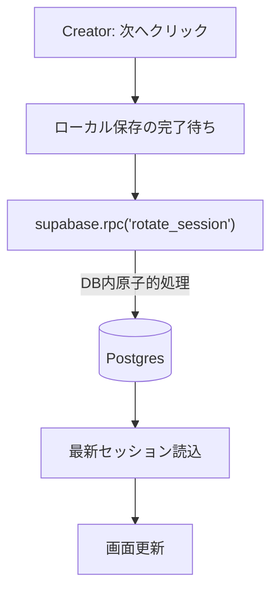

# Queue Party アーキテクチャ概要

本ドキュメントでは、Queue Party のフロントエンド/バックエンド構成、主要なデータモデル、典型フロー（セッション開始・ドラッグ&ドロップ・交代）、および運用上の工夫点を日本語で解説します。記事中のフロー図は Mermaid 記法で記載しています。

## 全体像

- 静的 SPA + “islands” 構成
  - 単一の `public/index.html` がベース。特定の UI（セットアップフォーム、管理設定、DnD）は React の「島（islands）」として `src/atlaskit-forms.tsx` から IIFE バンドル（`public/assets/atlaskit-forms.iife.js`）を生成し、必要な場所にマウント。
- バックエンドは Supabase（Postgres + RPC + Realtime + Edge Function）
  - 状態永続化、交代（ローテーション）ロジック、セッションのクリーンアップを担う。
- デプロイは静的ホスティング（例: Vercel）。ビルド時に Supabase の URL/Key を注入（`build.js`）。

```mermaid
graph LR
  A["Browser<br/>public/index.html<br/>静的SPA"] -- React Islands(IIFE) --> B["Islands<br/>atlaskit-forms.iife.js"]
  A -- Fetch/Realtime/RPC --> C["Supabase<br/>Postgres + RPC + Realtime"]
  C -->|Edge Function(掃除)| D[cleanup-sessions]
  B <--> A
```

## フロントエンド

- ホスト（非モジュールスクリプト）: `public/index.html`
  - アプリ全体の状態 `appState` を保持（セッション、ユーザー、定員、作成者/閲覧者モード等）。
  - 画面切替: 作成者UI（管理セクション）と閲覧者UIを `showManagementSection()` / `showViewSection()` で制御。
  - 保存/読込: `saveSessionToSupabase()` / `saveUsersToSupabase()` / `loadSessionFromSupabase()`。
  - リアルタイム: ビューア向けの反映や接続状態バナー表示。
  - ログ制御: 既定で `console.log/info/debug` を抑制。`?debug` 付与 or `setDebugLogging(true)` で有効化。

- React Islands: `src/atlaskit-forms.tsx` → `public/assets/atlaskit-forms.iife.js`
  - SetupForm: 初期セットアップ（主ユーザー名、パーティー人数、承認制）を強化。既存DOMへ値を同期し互換性維持。
  - ManagementSettings: パーティー人数・交代人数・登録モードの管理。変更は既存DOMに反映し、ホストのロジックを呼び出し。
  - DnD Island: `react-beautiful-dnd` によるパーティー/キューの並べ替え・移動。
    - ホストとの連携: `window.getAppState()`（読み取り）と `window.applyDnD(newParty, newQueue)`（保存）で橋渡し。
    - ドラッグ中の描画は `renderClone` + Portal（`document.body`）でオフセットズレを防止。
    - 定員超過の防止: `onDragEnd` と `applyDnD` の両方でガード（多層防御）。

- レガシー DnD（フォールバック）
  - `Sortable.js` を使用（Islands未使用時のみ有効化）。
  - `canMove()` で定員・固定ユーザーの制約を事前判定。

## ビルド / コンフィグ

- `vite.config.ts`: TS → IIFE（`public/assets/atlaskit-forms.iife.js`）を出力。`public/assets` に生成、既存ファイルを上書きしない設定。
- `build.js`: `SUPABASE_URL` / `SUPABASE_ANON_KEY` を `public/config.js` に書き出し、`index.html` にも `<script id="env-config">` として埋め込み（冗長化）。
- `vercel.json`: 静的配信設定（`public/`）。

## データモデル

- `sessions`
  - `session_code`, `creator_token`, `party_size`, `rotation_count`, `updated_at` 他。
- `session_users`
  - `session_id`, `user_id`, `name`, `position`（`'party'|'queue'`）, `order_index`, `is_fixed`, `created_at` 他。

- 制約/インデックス（`database/migrations/*`）
  - 一意: `(session_id, user_id)`
  - 一意: `(session_id, position, order_index)` DEFERRABLE INITIALLY DEFERRED
  - インデックス: `(session_id, position)`, `(session_id, position, order_index)`
  - 正規化: `order_index` を 0..N-1 に揃えるメンテナンス

## ビジネスロジック

### セッション開始

```mermaid
flowchart TD
  U[ユーザー] --> F["SetupForm<br/>(Atlaskit)"]
  F -->|startSession()| H[ホストJS]
  H -->|session/users 保存| DB[(Supabase)]
  H -->|URL更新| H
  H -->|管理UI表示/初期化| M[Management UI]
  M -->|DnD初期化| D[DnD Island]
  H -->|Realtime購読| DB
```

ポイント:
- `startSession()` で `sessionCode` と `creatorToken` を生成し、主ユーザー（固定）を作成。
- 保存成功後、URL に `?session=...&creator=...` を付加、管理画面へ遷移。

### ドラッグ&ドロップ（DnD 更新）

```mermaid
flowchart TD
  D[DnD Island] -->|onDragEnd| G[定員チェック]
  G -->|満員| N[通知して中止]
  G -->|OK| A[window.applyDnD(newParty,newQueue)]
  A -->|防御チェック(定員超過拒否)| H[ホストJS]
  H -->|saveUsersToSupabase| DB[(Supabase)]
  H -->|updateDisplay| V[Viewer]
  DB -->|Realtime/ポーリング| V
```

ポイント:
- フロント側で「事前チェック（Island）」と「保存直前の防御（applyDnD）」の二段構え。
- ビューアは Realtime で更新反映。

### 交代（「次へ」）



サーバー側ロジック（`docs/rotation-rpc/db_changes/functions.rotate_session.sql`）:
- `session_code` に対するアドバイザリロックで排他制御。
- 固定ユーザーを除外して `rotation_count` 分を party→queue、queue 先頭から party へ。
- 不足補充（party_size 未満なら queue から補充）、`order_index` 正規化。
- `creator_token` 検証で作成者のみ実行可。

## リアルタイム / 同期

- 作成者の操作は DB に保存後、閲覧者へ Realtime で反映（必要に応じてポーリング）。
- 交代は RPC（DB内原子的処理）を単一の真実とし、UI レースコンディション回避。

## セキュリティ

- 作成者 URL は `creator_token` を含む。閲覧者 URL には含めない。UI上でも秘匿を促す。
- RPC 側で `creator_token` を検証。`SECURITY DEFINER` で実行権限を制御。
- 将来的には RLS（行レベルセキュリティ）ポリシーも検討（セッションコードでスコープ）。

## 信頼性 / 運用

- 一意制約と DEFERRABLE 制約により再並び替え時の一貫性を担保。
- 交代時のアドバイザリロックでセッション単位の直列化。
- Edge Function `cleanup-sessions` により古いセッションのクリーンアップ。

## UX / アクセシビリティ

- Islands 導入で UI を段階的にモダナイズしつつ、既存 DOM と互換性維持。
- ARIA ライブリージョン、リスト役割やラベル付け、フォーカス可視化を確保。
- ドラッグ中の要素はポータル描画により正しくカーソル追従（オフセット問題の回避）。

## 主要ファイル

- フロント: `public/index.html`, `public/config.js`
- Islands: `src/atlaskit-forms.tsx` → `public/assets/atlaskit-forms.iife.js`
- ビルド/デプロイ: `vite.config.ts`, `build.js`, `vercel.json`
- DB: `database/migrations/*`, ドキュメント: `docs/rotation-rpc/*`
- メンテナンス: `supabase/functions/cleanup-sessions/*`

## 今後の拡張案

- RLS ポリシー導入と JWT スコープでアクセス制御を強化。
- DnD のレガシー経路（Sortable）を段階的に廃止し一本化。
- DnD 容量制約や交代不変条件の E2E テスト整備。
- 承認制の通知/更新を Realtime Events で強化し、UI を最適化。
